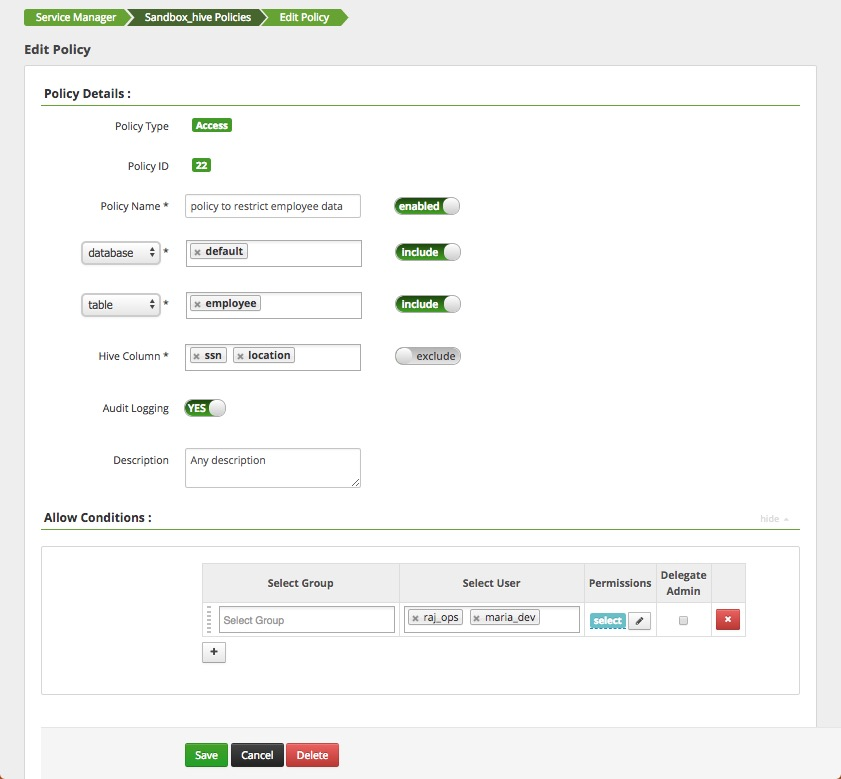
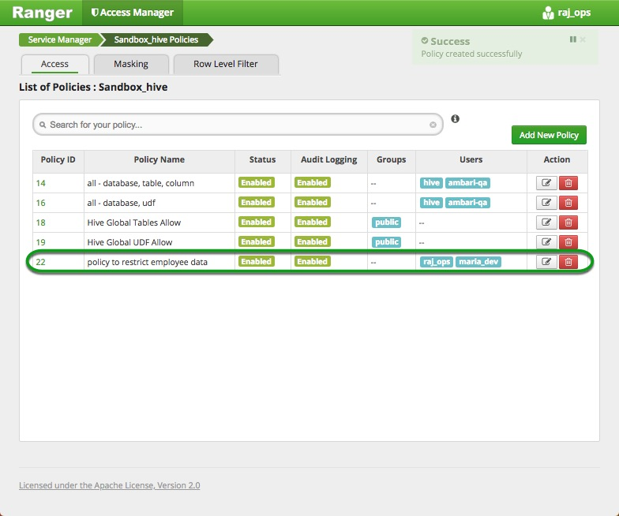
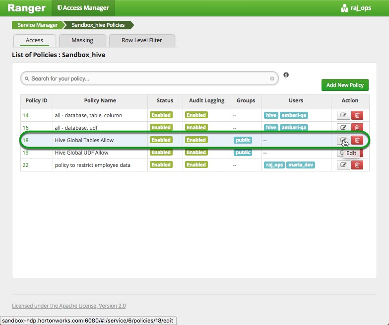

# Tag Based Policies with Apache Ranger and Apache Atlas

## Assigning Tag Based Policies with Atlas

## Introduction

In this section of the tutorial you will begin assigning policies to the users of our sandbox, you will be introduced to user accounts available and then you will assign permissions on data based on the persona's role.

## Prerequisites

- Downloaded and deployed the [Hortonworks Data Platform (HDP)](https://hortonworks.com/downloads/#sandbox) Sandbox
- [Learning the Ropes of the HDP Sandbox](https://hortonworks.com/tutorial/learning-the-ropes-of-the-hortonworks-sandbox/)

## Outline

- [Concepts](#concepts)
- [Sandbox User Personas Policy](#sandbox-user-personas-policy)
- [Access Without Tag Based Policies](#access-without-tag-based-policies)
- [Create a Ranger Policy to Limit Access of Hive Data](#create-a-ranger-policy-to-limit-access-of-hive-data)
- [Create Atlas Tag to Classify Data](#create-atlas-tag-to-classify-data)
- [Create Ranger Tag Based Policy](#create-ranger-tag-based-policy)
- [Summary](#summary)
- [Further Reading](#further-reading)

## Concepts

The Sandbox's Hive policies are such that when a new table is created, everyone has access to it. This is convenient for us because the data in the tables we create is fictitious; however, image a scenario where a Hive table hold sensitive information (e.g. SSN, or Birthplace) we should be able to Govern the data and only give access to authorized users. In this section we will recreate a scenario where certain users do not have access to sensitive data; however, Raj our cluster operator has been approved to access the data, so we will create Tag Based Policies to granularly grant him access to the sensitive data.

## Access Without Tag Based Policies

In this section you will create a brand new hive table called `employee` in the `default` database of our Sandbox.

Keep in mind, for this new table, no policies have been created to authorize what our sandbox users can access within this table and its columns.

1\. Go to **Hive View 2.0**. Hover over the Ambari views and select **Hive View 2.0**.

2\. Create the `employee` table:

~~~sql
create table employee (ssn string, name string, location string)
row format delimited
fields terminated by ','
stored as textfile;
~~~

Then, click the green `Execute` button.

3\. Verify the table was created successfully by going to the **TABLES** tab:

4\. Now we will populate this table with data.

5\. Enter the HDP Sandbox's CentOS command line interface by using the Web Shell Client at 

~~~text
sandbox-hdp.hortonworks.com:4200
~~~

Login credentials are:

username = `root`
password = `hadoop`

>Note: hadoop is the initial password, but you will asked to change it after first sign in.

5\. Create the `employeedata.txt` file with the following data using the command:

~~~bash
printf "111-111-111,James,San Jose\\n222-222-222,Mike,Santa Clara\\n333-333-333,Robert,Fremont" > employeedata.txt
~~~

6\. Copy the employeedata.txt file from your centOS file system to HDFS. The particular location the file will be stored in is Hive warehouse's employee table directory:

~~~bash
hdfs dfs -copyFromLocal employeedata.txt /apps/hive/warehouse/employee
~~~

7\. Go back to Hive View 2.0. Verify the hive table **employee** has been populated with data:

~~~sql
select * from employee;
~~~

**Execute** the hive query to the load the data.

Notice you have an **employee** data table in Hive with ssn, name and location
as part of its columns.

The **ssn** and **location** columns hold **sensitive** information
and most users should not have access to it.

## Create a Ranger Policy to Limit Access of Hive Data

Your goal is to create a Ranger Policy which allows general users access to the **name**
column while excluding them access to the **ssn and location** columns.

This policy will be assigned to **maria_dev** and **raj_ops**.

1\. Go to Ranger UI on:

~~~text
sandbox-hdp.hortonworks.com:6080
~~~

2\. Click on **sandbox_hive** and then select **Add New Policy**:

3\. In the **Policy Details** field, enter following values:

~~~text
Policy Name - policy to restrict employee data
Hive Databases - default
table - employee
Hive_column - ssn, location (NOTE : Do NOT forget to EXCLUDE these columns)
Description - Any description
~~~

4\. In the **Allow Conditions**, it should have the following values:

~~~text
Select Group – blank, no input
Select User – raj_ops, maria_dev
Permissions – Click on the + sign next to Add Permissions and click on select and then green tick mark.
~~~

You should have your policy configured like this:

5\. Click on `Add` and you can see the list of policies that are present in `Sandbox_hive`.

6\. Disable the `Hive Global Tables Allow` Policy to take away `raj_ops` and `maria_dev`
access to the employee table's ssn and location column data.

 Go inside this Policy,
to the right of `Policy Name` there is an `enable button` that can be toggled to
`disabled`. Toggle it. Then click **save**.

### Verify Ranger Policy is in Effect

1\. To check the access if `maria_dev` has access to the Hive `employee` table,
re-login to Ambari as `maria_dev` user.

2\. Go directly to `Hive View 2.0`, then **QUERY** tab, write the hive script to load the data from employee table.

~~~sql
select * from employee;
~~~

3\. You will notice a red message appears. Click on the **NOTIFICATIONS** tab:

Authorization error will appear. This is expected as the user `maria_dev` and
`raj_ops` do not have access to 2 columns in this table (ssn and location).

4\. For further verification, you can view the **Audit** tab in Ranger.
Go back to Ranger and click on `Audits=>Access` and select
`Service Name=>Sandbox_hive`. You will see the entry of Access Denied
for maria_dev. maria_dev tried to access data she didn't have authorization
to view.

5\. Return to `Hive View 2.0`, try running a query to access the `name` column
from the `employee` table. `maria_dev` should be able to access that data.

~~~sql
SELECT name FROM employee;
~~~

The query runs successfully.
Even, **raj_ops** user cannot not see all the columns for the location and SSN.
We will provide access to this user to all columns later via Atlas Ranger Tag
Based Policies.

## Create Atlas Tag to Classify Data

The goal of this section is to classify all data in the ssn and location columns
with a **PII*** tag. So later when we create a Ranger Tag Based Policy, users
who are associated with the **PII** tag can override permissions established in
the Ranger Resource Board policy.

1\. Reset Admin user password:

If you haven't already reset your [Ambari Admin password](https://hortonworks.com/tutorial/learning-the-ropes-of-the-hortonworks-sandbox/#admin-password-reset)
we will use it to log into Atlas.

1\. Login into Atlas UI

~~~text
http://sandbox-hdp.hortonworks.com:21000/
~~~

username & password : **Admin/<your_password>**

2\. Go to Tags and press the `+ Create Tag` button to create a new tag.

- Name the tag: `PII`
- Add Description: `Personal Identifiable Information`

Press the **Create** button. Then you should see your new tag displayed on the Tag
page:

3\. Go to the `Search` tab. In `Search By Type`, write `hive_table`

4\. `employee` table should appear. Select it.

- How does Atlas get Hive employee table?

Hive communicates information through Kafka, which then is transmitted to Atlas.
This information includes the Hive tables created and all kinds of data
associated with those tables.

5\. View the details of the `employee` table by clicking on its name.

6\. View the **Schema** associated with
the table. It'll list all columns of this table.

7\. Press the **blue +** button to assign the `PII` tag to the `ssn` column.
Click **save**.

8\. Repeat the same process to add the `PII` tag to the `location` column.

We have classified all data in the `ssn and location` columns as `PII`.

## Create Ranger Tag Based Policy

Head back to the Ranger UI and log in using

~~~text
Username/Password: admin/<your_password>
~~~
The tag and entity (ssn, location) relationship will be automatically inherited by Ranger. In Ranger, we can create a tag based policy
by accessing it from the top menu. Go to `Access Manager → Tag Based Policies`.

You will see a folder called TAG that does not have any repositories yet.

Click `+` button to create a new tag repository.

Name it `Sandbox_tag` and click `Add`.

Click on `Sandbox_tag` to add a policy.

Click on the `Add New Policy` button.
Give following details:

~~~text
Policy Name – PII column access policy
Tag – PII
Description – Any description
Audit logging – Yes
~~~

In the Allow Conditions, it should have the following values:

~~~text
Select Group - blank
Select User - raj_ops
Component Permissions - Select hive
~~~

You can select the component permission through the following popup. Check the
**checkbox** to the left of the word component to give `raj_ops` permission to
`select, update, create, drop, alter, index, lock and all` operations against
the hive table `employee` columns specified by `PII` tag.

Please verify that Allow Conditions section is looking like this:

This signifies that only `raj_ops` is allowed to do any operation on the columns that are specified by PII tag. Click `Add`.

Now click on `Resource Based Policies` and edit `Sandbox_hive` repository by clicking on the button next to it.

Click on `Select Tag Service` and select `Sandbox_tag`. Click on `Save`.

The Ranger tag based policy is now enabled for **raj_ops** user. You can test it by running the query on all columns in employee table.

~~~sql
select * from employee;
~~~

The query executes successfully. The query can be checked in the Ranger audit log which will show the access granted and associated policy which granted access. Select Service Name as `Sandbox_hive` in the search bar.

> **NOTE**: There are 2 policies which provided access to raj_ops user, one is a tag based policy and the other is hive resource based policy. The associated tags (PII) is also denoted in the tags column in the audit record).

## Summary

Ranger traditionally provided group or user based authorization for resources such as table, column in Hive or a file in HDFS.
With the new Atlas -Ranger integration, administrators can conceptualize security policies based on data classification, and not necessarily in terms of tables or columns. Data stewards can easily classify data in Atlas and use in the classification in Ranger to create security policies.
This represents a paradigm shift in security and governance in Hadoop, benefiting customers with mature Hadoop deployments as well as customers looking to adopt Hadoop and big data infrastructure for first time.

## Further Reading

- For more information on Ranger and Solr Audit integration, refer to [Install and Configure Solr For Ranger Audits](https://cwiki.apache.org/confluence/display/RANGER/Install+and+Configure+Solr+for+Ranger+Audits+-+Apache+Ranger+0.5)
- How Ranger provides Authorization for Services within Hadoop, refer to [Ranger FAQ](http://ranger.apache.org/faq.html)
- [HDP Security Doc](https://docs.hortonworks.com/HDPDocuments/HDP2/HDP-2.6.5/bk_security/content/ch_hdp-security-guide-overview.html)
- [Integration of Atlas and Ranger Classification-Based Security Policies](https://hortonworks.com/solutions/security-and-governance/)
